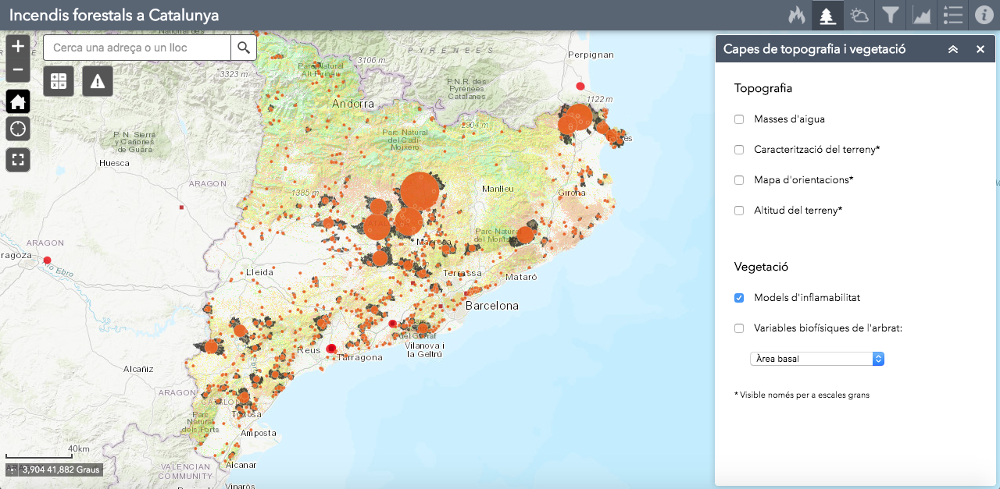

# Incendis forestals a Catalunya

El [visor d'incendis forestals de Catalunya]((https://storage.googleapis.com/incendis/index.html)) permet consultar en un mapa interactiu les dades dels incendis forestals produïts a Catalunya des del 1986. Aquestes dades es poden visualitzar juntament amb altres paràmetres com el risc d'incendi, la topografia, la vegetació i la meteorologia. El visor també permet obtenir dades a temps real dels focs actius, la meteorologia i els llamps.

El [mapa web](https://www.arcgis.com/home/webmap/viewer.html?webmap=52430fa6fb14425cad22888102aaf712) s'ha creat amb [ArcGIS Online](https://www.arcgis.com/) i l'aplicació s'ha desenvolupat amb [Web AppBuilder](https://developers.arcgis.com/web-appbuilder/). Els *widgets* [Incendis](https://github.com/vboix2/Incendis-forestals/tree/master/widgets/Incendis), [Terreny](https://github.com/vboix2/Incendis-forestals/tree/master/widgets/Terreny) i [Meteo](https://github.com/vboix2/Incendis-forestals/tree/master/widgets/Meteo) s'han desenvolupat a partir de l'[API d'ArcGIS per JavaScript](https://developers.arcgis.com/javascript/3/).

Aquest projecte és el resultat del Treball Final del [Màster Universitari en Ciència de Dades de la UOC](https://estudis.uoc.edu/ca/masters-universitaris/data-science/presentacio).

## Fonts de dades

### Incendis i risc d'incendi

* **Focs actius**: [Fire information for resource Management System (NASA). Web Services](https://firms.modaps.eosdis.nasa.gov/web-services/)

* **Incendis forestals**: [Departament d'Agricultura, Ramaderia, Pesca i Alimentació. Base cartogràfica d'incendis forestals](http://agricultura.gencat.cat/ca/serveis/cartografia-sig/bases-cartografiques/boscos/incendis-forestals/incendis-forestals-format-shp/)

* **Cremes prescrites**: [Departament d'Interior. Cremes prescrites Bombers Catalunya 1998-2015](https://analisi.transparenciacatalunya.cat/Medi-Ambient/Cremes-Prescrites-Bombers-Catalunya-1998-2015/k2qh-v6rz)

* **Zones homogènies de règim d'incendis**: [Departament d'Interior. Arxiu de les zones homogènies de règim d'incendis forestals](https://interior.gencat.cat/ca/serveis/informacio-geografica/bases-cartografiques/zones-homogenies-de-regim-dincendis-forestals/)

* **Risc estàtic d'incendi forestal**: [Departament de Territori i Sostenibilitat. Serveis web geogràfics: Vegetació](http://territori.gencat.cat/ca/01_departament/12_cartografia_i_toponimia/serveis_web_geografics/#bloc17)

### Topografia i vegetació

* **Masses d'aigua**: [Agència Catalana de l'Aigua. Descàrrega cartogràfica](http://aca.gencat.cat/ca/laigua/consulta-de-dades/descarrega-cartografica/)

* **Caracterització del territori**: [Esri Living Atlas, Ministerio de Agricultura, Alimentación y Medio Ambiente, Instituto Geográfico Nacional de España](https://services1.arcgis.com/nCKYwcSONQTkPA4K/arcgis/rest/services/TeselaEspana_WFL1/FeatureServer/0)

* **Mapa d'orientacions**: [Institut Cartogràfic i Geològic de Catalunya. WMS Mapes d'elevacions, orientació i ombres](https://www.icgc.cat/Administracio-i-empresa/Serveis/Geoinformacio-en-linia-Geoserveis/WMS-i-WCS-Elevacions/WMS-Mapes-d-elevacions-orientacio-i-ombres)

* **Altitud del terreny**: [Institut Cartogràfic i Geològic de Catalunya. WMS Mapes d'elevacions, orientació i ombres](https://www.icgc.cat/Administracio-i-empresa/Serveis/Geoinformacio-en-linia-Geoserveis/WMS-i-WCS-Elevacions/WMS-Mapes-d-elevacions-orientacio-i-ombres)

* **Models d'inflamabilitat**: [Departament de Territori i Sostenibilitat. Serveis web geogràfics: Vegetació](http://territori.gencat.cat/ca/01_departament/12_cartografia_i_toponimia/serveis_web_geografics/#bloc17)

* **Variables biofísiques de l'arbrat**: [Institut Cartogràfic i Geològic de Catalunya. WMS Mapes de variables biofísiques de l'arbrat de Catalunya](https://www.icgc.cat/Administracio-i-empresa/Serveis/Geoinformacio-en-linia-Geoserveis/WMS-Vegetacio/WMS-Mapes-de-variables-biofisiques-de-l-arbrat-de-Catalunya)

### Meteorologia

* **Direcció del vent**: [Esri Living Atlas, NOAA](https://services9.arcgis.com/RHVPKKiFTONKtxq3/arcgis/rest/services/NOAA_METAR_current_wind_speed_direction_v1/FeatureServer)

* **Llamps núvol-terra**: [Servei Meteorològic de Catalunya. API de Dades Meteorològiques, Dades de la Xarxa de Detecció de Descàrregues Elèctriques](https://apidocs.meteocat.gencat.cat/)

* **Estacions Meteorològiques (XEMA)**: [Servei Meteorològic de Catalunya. Metadades de la Xarxa d'Estacions Meteorològiques Automatitzades](https://analisi.transparenciacatalunya.cat/Medi-Ambient/Metadades-estacions-meteorol-giques-autom-tiques/yqwd-vj5e/data)

* **Mapes climàtics**: [Departament de Territori i Sostenibilitat. Serveis web geogràfics: Atmosfera, qualitat de l'aire i climatologia](http://territori.gencat.cat/ca/01_departament/12_cartografia_i_toponimia/serveis_web_geografics/#bloc2)

* **Situació meteorològica dels incendis**: [Servei Meteorològica de Catalunya. Dades meteorològiques de la XEMA](https://analisi.transparenciacatalunya.cat/Medi-Ambient/Dades-meteorol-giques-de-la-XEMA/nzvn-apee/data)

